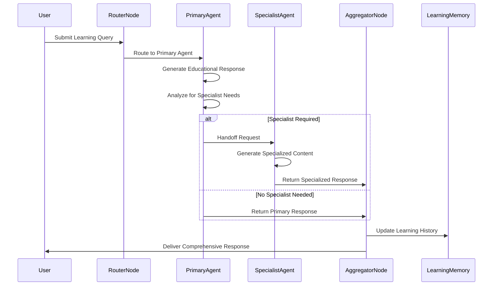
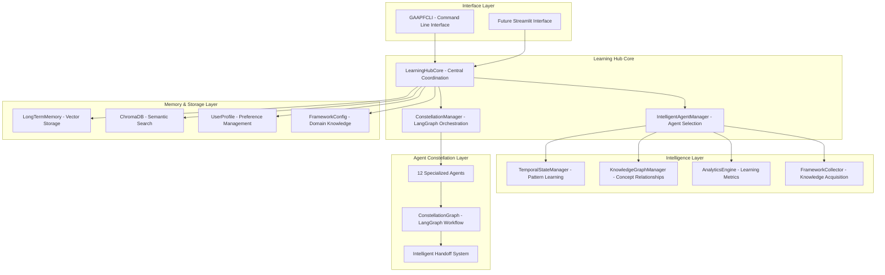
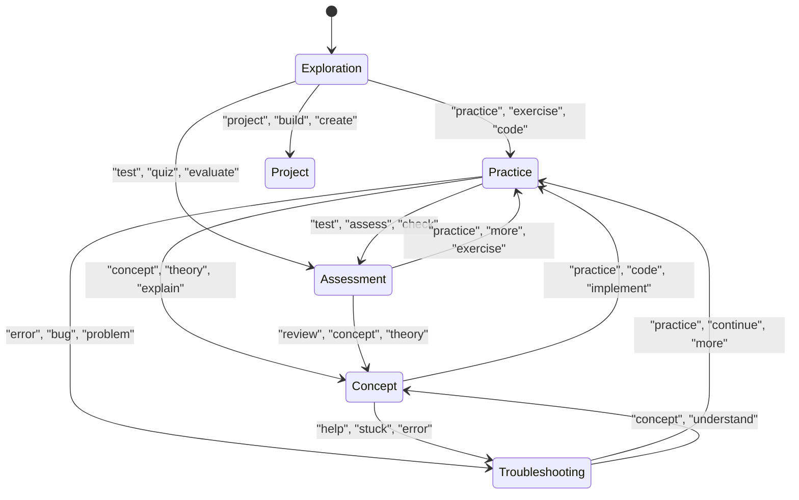
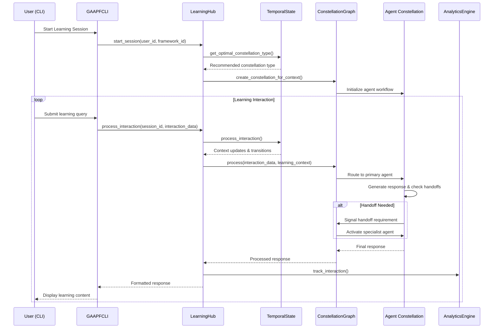
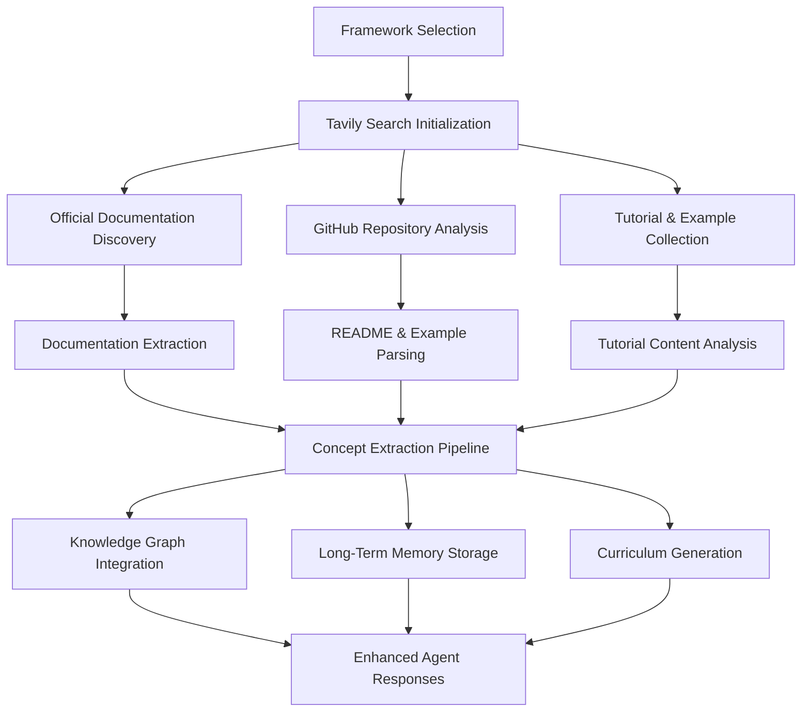
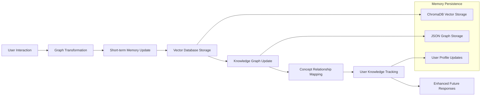
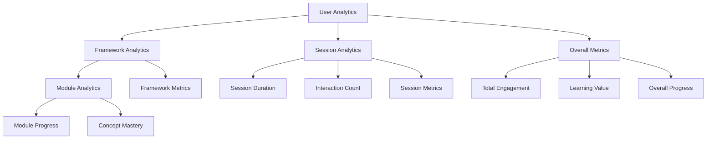

# Extended GAAPF Methodology Report: Implementation-Based Analysis

## 1. Executive Summary

This extended methodology report provides a comprehensive analysis of the GAAPF (Guidance AI Agent for Python Framework) system implementation, building upon the foundational methodology while incorporating detailed workflow analysis from the actual codebase. The system demonstrates a sophisticated adaptive multi-agent learning architecture that dynamically forms specialized agent constellations through LangGraph orchestration, temporal learning optimization via TemporalStateManager, and comprehensive analytics tracking through AnalyticsEngine integration.

## 2. GAAPF System Architecture

Inspired by the architectural principles of modern AI agent platforms like [OpenHands](https://arxiv.org/pdf/2407.16741), GAAPF implements a sophisticated multi-layered architecture designed for educational AI agents that interact with learning environments through code execution, knowledge synthesis, and intelligent coordination. The architecture enables the development of powerful and flexible learning agents that interact with educational frameworks in ways similar to those of a human developer: by analyzing documentation, writing code examples, facilitating practice sessions, and providing comprehensive guidance.

We describe how the GAAPF platform allows for the implementation of new specialized learning agents, safe interaction with sandboxed learning environments, coordination between multiple educational agents, and incorporation of comprehensive learning evaluation benchmarks. The system supports both immediate learning interactions and long-term educational progression tracking.

### 2.1 AGENT DEFINITION AND IMPLEMENTATION

The GAAPF system provides a flexible agent abstraction that allows for the implementation of diverse educational agents, each specialized for different aspects of the learning process. Similar to how OpenHands enables software development agents, GAAPF enables learning facilitation agents through a standardized interface.

#### 2.1.1 Agent Abstraction Layer

Each educational agent in GAAPF inherits from the base `SpecializedAgent` class and must implement the core learning interaction method:

```python
class SpecializedAgent:
    def __init__(self, llm: BaseLanguageModel, tools: List[Union[str, BaseTool]], 
                 memory_path: Optional[Path], config: Dict, agent_type: str, 
                 description: str, is_logging: bool = False):
        self.llm = llm
        self.tools = tools
        self.agent_type = agent_type
        self.description = description
        self.memory = self._initialize_memory(memory_path)
        self.config = config
        
    def invoke(self, query: str, user_id: str = None, **kwargs) -> AgentResponse:
        """Core method for processing learning interactions"""
        pass
        
    def _determine_next_agent(self, content: str, state: Dict) -> Optional[str]:
        """Analyze content to determine if handoff to another agent is needed"""
        pass
```

#### 2.1.2 Educational Agent Specializations

GAAPF implements 12 specialized educational agents, each designed for specific learning contexts:

**Knowledge Domain Agents:**
- **Instructor Agent**: Provides structured explanations and concept breakdowns
- **Documentation Expert**: Delivers API references and technical specifications  
- **Research Assistant**: Conducts information discovery and resource gathering
- **Knowledge Synthesizer**: Creates connections between concepts and builds mental models

**Practice Domain Agents:**
- **Code Assistant**: Generates code examples and implementation guidance
- **Practice Facilitator**: Creates exercises and skill-building activities
- **Project Guide**: Provides project planning and real-world application guidance
- **Troubleshooter**: Offers debugging assistance and problem-solving strategies

**Support Domain Agents:**
- **Mentor**: Delivers personalized guidance and learning motivation
- **Motivational Coach**: Maintains engagement and builds confidence

**Assessment Domain Agents:**
- **Assessment Agent**: Evaluates knowledge and validates skills
- **Progress Tracker**: Monitors learning analytics and achievement

#### 2.1.3 Event-Driven Learning Architecture

GAAPF employs an event stream architecture similar to OpenHands, where learning interactions are managed through structured events that track the educational process:

```python
class LearningEvent:
    def __init__(self, event_type: str, content: Dict, timestamp: float, 
                 user_id: str, agent_type: str):
        self.event_type = event_type  # 'query', 'response', 'handoff', 'assessment'
        self.content = content
        self.timestamp = timestamp
        self.user_id = user_id
        self.agent_type = agent_type

class LearningEventStream:
    def __init__(self):
        self.events: List[LearningEvent] = []
        self.subscribers: List[Callable] = []
    
    def add_event(self, event: LearningEvent):
        self.events.append(event)
        self._notify_subscribers(event)
```

### 2.2 LEARNING RUNTIME ENVIRONMENT

The GAAPF runtime environment provides a comprehensive educational sandbox that enables safe interaction with learning materials, code execution, and knowledge exploration without affecting the user's system.

#### 2.2.1 Educational Sandbox Components

**Learning Memory Environment:**
- **ChromaDB Vector Storage**: Semantic similarity search for educational content
- **Long-term Memory System**: Persistent learning history and concept tracking
- **Knowledge Graph**: Dynamic concept relationship mapping
- **User Profile Management**: Learning preferences and progress tracking

**Code Execution Environment:**
- **Safe Code Execution**: Sandboxed Python environment for practice exercises
- **Framework Testing**: Isolated testing environment for AI framework examples
- **Tool Integration**: Access to educational tools and libraries
- **File System Management**: Temporary workspace for learning projects

**Knowledge Discovery Environment:**
- **Web Search Integration**: Tavily-powered documentation and tutorial discovery
- **Framework Information Collection**: Automated knowledge gathering for AI frameworks
- **Content Analysis**: Intelligent extraction of concepts and examples
- **Resource Curation**: Organization of learning materials and references

#### 2.2.2 Runtime Action Execution

The GAAPF runtime translates educational actions into observable learning outcomes:

```python
class LearningAction:
    def execute(self, runtime: LearningRuntime) -> LearningObservation:
        """Execute educational action and return learning observation"""
        pass

class ExplainConceptAction(LearningAction):
    def __init__(self, concept: str, framework: str, user_level: str):
        self.concept = concept
        self.framework = framework  
        self.user_level = user_level
    
    def execute(self, runtime: LearningRuntime) -> LearningObservation:
        # Retrieve relevant knowledge from memory
        context = runtime.memory.query_similar_memories(self.concept)
        
        # Generate explanation based on user level
        explanation = runtime.generate_explanation(
            concept=self.concept,
            context=context,
            user_level=self.user_level
        )
        
        return LearningObservation(
            type="explanation",
            content=explanation,
            metadata={"concept": self.concept, "framework": self.framework}
        )
```

#### 2.2.3 Learning Environment Safety

GAAPF implements comprehensive safety measures for educational interactions:

- **Sandboxed Code Execution**: All code examples run in isolated environments
- **Content Validation**: Educational materials are validated for accuracy and appropriateness
- **Progress Tracking**: Learning activities are monitored for effectiveness
- **Resource Management**: System resources are managed to prevent overuse

### 2.3 EDUCATIONAL SKILL MANAGEMENT

GAAPF provides a comprehensive skill management system that enables agents to reliably access and extend educational capabilities for enhanced learning experiences.

#### 2.3.1 Framework Knowledge Skills

**Documentation Analysis Skills:**
```python
def analyze_framework_documentation(framework_name: str, user_id: str) -> Dict:
    """Extract and organize framework documentation for learning purposes"""
    collector = FrameworkCollector(is_logging=True)
    framework_info = await collector.collect_framework_info(
        framework_name=framework_name,
        user_id=user_id,
        include_docs=True,
        include_github=True
    )
    return framework_info

def extract_learning_concepts(documentation: str, framework: str) -> List[Dict]:
    """Extract key learning concepts from framework documentation"""
    concepts = []
    # Concept extraction logic using NLP and pattern recognition
    return concepts
```

**Code Example Generation Skills:**
```python
def generate_code_example(concept: str, framework: str, difficulty: str) -> str:
    """Generate appropriate code examples for learning concepts"""
    template = get_example_template(framework, difficulty)
    example = generate_from_template(template, concept)
    return validate_code_example(example)

def create_practice_exercise(concept: str, user_level: str) -> Dict:
    """Create interactive practice exercises"""
    exercise = {
        "title": f"Practice: {concept}",
        "description": generate_exercise_description(concept, user_level),
        "starter_code": generate_starter_code(concept),
        "solution": generate_solution(concept),
        "hints": generate_hints(concept, user_level)
    }
    return exercise
```

#### 2.3.2 Assessment and Evaluation Skills

**Knowledge Assessment Skills:**
```python
def assess_user_understanding(user_response: str, concept: str) -> Dict:
    """Evaluate user understanding of learning concepts"""
    assessment = {
        "comprehension_score": calculate_comprehension(user_response, concept),
        "identified_gaps": identify_knowledge_gaps(user_response, concept),
        "recommendations": generate_learning_recommendations(user_response, concept)
    }
    return assessment

def track_learning_progress(user_id: str, session_data: Dict) -> Dict:
    """Monitor and analyze learning progress"""
    analytics = AnalyticsEngine()
    progress = analytics.calculate_progress_metrics(user_id, session_data)
    return progress
```

#### 2.3.3 Learning Resource Management

**Content Curation Skills:**
```python
def curate_learning_resources(topic: str, user_level: str) -> List[Dict]:
    """Curate appropriate learning resources for topics"""
    resources = []
    
    # Search for tutorials and examples
    search_results = search_web(f"{topic} tutorial {user_level}")
    
    # Filter and rank resources
    for result in search_results.get("results", []):
        if is_appropriate_resource(result, user_level):
            resources.append({
                "title": result.get("title"),
                "url": result.get("url"),
                "description": result.get("snippet"),
                "difficulty": assess_resource_difficulty(result),
                "relevance": calculate_relevance_score(result, topic)
            })
    
    return sorted(resources, key=lambda x: x["relevance"], reverse=True)
```

### 2.4 MULTI-AGENT COORDINATION

GAAPF implements sophisticated multi-agent coordination through the ConstellationGraph system, enabling multiple specialized educational agents to work together seamlessly for comprehensive learning experiences.

#### 2.4.1 Constellation Formation and Coordination

The ConstellationManager dynamically forms agent teams based on learning context and user needs:

```python
class ConstellationManager:
    def __init__(self, agents: Dict[str, SpecializedAgent]):
        self.agents = agents
        self.constellation_configs = load_constellation_configs()
    
    def form_constellation(self, learning_context: Dict) -> Constellation:
        """Form optimal agent constellation for learning context"""
        constellation_type = self.determine_constellation_type(learning_context)
        config = self.constellation_configs[constellation_type]
        
        selected_agents = {}
        for agent_type in config.primary_agents + config.support_agents:
            if agent_type in self.agents:
                selected_agents[agent_type] = self.agents[agent_type]
        
        return Constellation(
            agents=selected_agents,
            constellation_type=constellation_type,
            config=config
        )
```

#### 2.4.2 Intelligent Agent Handoff Mechanisms

The system implements context-aware handoff logic through LangGraph workflows:

```python
class ConstellationGraph:
    def _check_automatic_handoff(self, response: Dict, state: Dict) -> Optional[Dict]:
        """Determine if handoff to another agent is needed"""
        current_agent = state["current_agent"]
        content = response.get("content", "").lower()
        
        handoff_rules = {
            ("code", "implementation", "example"): "code_assistant",
            ("error", "bug", "debug"): "troubleshooter", 
            ("documentation", "reference", "api"): "documentation_expert",
            ("practice", "exercise", "challenge"): "practice_facilitator",
            ("assess", "evaluate", "test"): "assessment",
            ("connect", "integrate", "synthesize"): "knowledge_synthesizer"
        }
        
        for keywords, target_agent in handoff_rules.items():
            if any(keyword in content for keyword in keywords):
                if target_agent != current_agent and target_agent in self.agents:
                    return {
                        "agent": target_agent,
                        "reason": f"Content analysis suggests need for {target_agent}"
                    }
        
        return None
```

#### 2.4.3 Educational Workflow Orchestration

The LangGraph-based workflow manages educational interactions across multiple agents:



#### 2.4.4 Learning Context Synchronization

All agents maintain synchronized learning context through shared state management:

```python
class LearningContext:
    def __init__(self, user_id: str, framework_id: str):
        self.user_id = user_id
        self.framework_id = framework_id
        self.current_module = "introduction"
        self.learning_stage = "exploration"
        self.current_activity = "concept_learning"
        self.user_knowledge = {}
        self.session_history = []
        self.temporal_insights = {}
    
    def update_from_interaction(self, interaction_data: Dict, response: Dict):
        """Update learning context based on interaction outcomes"""
        # Update learning progress
        self.session_history.append({
            "timestamp": time.time(),
            "interaction": interaction_data,
            "response": response
        })
        
        # Update knowledge tracking
        concepts = extract_concepts(response.get("content", ""))
        for concept in concepts:
            self.user_knowledge[concept] = self.user_knowledge.get(concept, 0) + 0.1
```

This architecture enables GAAPF to provide sophisticated educational experiences through coordinated multi-agent interactions, similar to how OpenHands enables complex software development tasks through agent collaboration. The system maintains educational focus while leveraging the power of specialized agent coordination for comprehensive learning support.

### 2.1 Core Architecture Layers



## 3. Enhanced Adaptive Learning Constellation Formation

### 3.1 Constellation Type Implementation Analysis

The system implements 5 specialized constellation types through the `constellation_types.py` module, each optimized for specific learning contexts:

#### 3.1.1 Learning Constellation
- **Primary Agents**: {Instructor, Documentation Expert, Knowledge Synthesizer}
- **Support Agents**: {Mentor, Research Assistant}
- **Optimization**: Knowledge acquisition and conceptual understanding
- **Usage Context**: Theoretical learning, concept exploration

#### 3.1.2 Practice Constellation  
- **Primary Agents**: {Code Assistant, Practice Facilitator}
- **Support Agents**: {Mentor, Troubleshooter}
- **Optimization**: Hands-on skill development
- **Usage Context**: Coding exercises, implementation practice

#### 3.1.3 Assessment Constellation
- **Primary Agents**: {Assessment Agent, Progress Tracker}
- **Support Agents**: {Instructor, Knowledge Synthesizer}
- **Optimization**: Knowledge evaluation and feedback
- **Usage Context**: Skill assessment, progress evaluation

#### 3.1.4 Project Constellation
- **Primary Agents**: {Project Guide, Code Assistant}
- **Support Agents**: {Documentation Expert, Troubleshooter}
- **Optimization**: Real-world application development
- **Usage Context**: Project development, integration tasks

#### 3.1.5 Troubleshooting Constellation
- **Primary Agents**: {Troubleshooter, Code Assistant}
- **Support Agents**: {Documentation Expert, Research Assistant}
- **Optimization**: Problem resolution and debugging
- **Usage Context**: Error resolution, debugging scenarios

### 3.2 Dynamic Constellation Selection Algorithm

The constellation selection process is implemented in the `TemporalState.get_optimal_constellation_type()` method:

```python
def get_optimal_constellation_type(self, user_id: str, learning_context: Dict) -> str:
    learning_stage = learning_context.get("learning_stage", "exploration")
    current_activity = learning_context.get("current_activity", "introduction")
    
    stage_to_constellation = {
        "exploration": "learning",
        "concept": "learning", 
        "practice": "practice",
        "assessment": "assessment",
        "project": "project",
        "troubleshooting": "troubleshooting"
    }
```

## 4. Comprehensive Agent Ecosystem Implementation

### 4.1 Twelve Specialized Agents Architecture

The system implements 12 domain-specialized agents organized into four functional clusters:

#### 4.1.1 Knowledge Domain Agents
1. **Instructor Agent** (`instructor.py`)
   - Core instruction and explanations
   - Concept breakdown and clarification
   - Learning path guidance

2. **Documentation Expert Agent** (`documentation_expert.py`)
   - API reference and documentation
   - Technical specification guidance
   - Reference material organization

3. **Research Assistant Agent** (`research_assistant.py`)
   - Information discovery and gathering
   - External resource identification
   - Knowledge synthesis support

4. **Knowledge Synthesizer Agent** (`knowledge_synthesizer.py`)
   - Concept connection and integration
   - Mental model construction
   - Cross-domain knowledge linking

#### 4.1.2 Practice Domain Agents
5. **Code Assistant Agent** (`code_assistant.py`)
   - Code generation and examples
   - Implementation guidance
   - Syntax and best practices

6. **Practice Facilitator Agent** (`practice_facilitator.py`)
   - Exercise creation and guidance
   - Skill-building activities
   - Progressive challenge design

7. **Project Guide Agent** (`project_guide.py`)
   - Project planning and architecture
   - Implementation strategy
   - Real-world application guidance

8. **Troubleshooter Agent** (`troubleshooter.py`)
   - Error diagnosis and resolution
   - Debugging assistance
   - Problem-solving strategies

#### 4.1.3 Support Domain Agents
9. **Mentor Agent** (`mentor.py`)
   - Personalized guidance and support
   - Learning motivation and encouragement
   - Goal setting and achievement tracking

10. **Motivational Coach Agent** (`motivational_coach.py`)
    - Engagement enhancement
    - Learning momentum maintenance
    - Confidence building

#### 4.1.4 Assessment Domain Agents
11. **Assessment Agent** (`assessment.py`)
    - Knowledge evaluation and testing
    - Skill assessment and validation
    - Competency measurement

12. **Progress Tracker Agent** (`progress_tracker.py`)
    - Learning analytics and metrics
    - Achievement monitoring
    - Progress visualization

## 5. Advanced LangGraph Orchestration and Handoff Mechanisms

### 5.1 ConstellationGraph Implementation

The `ConstellationGraph` class implements sophisticated agent coordination through LangGraph workflow management:

```python
class ConstellationGraph:
    def __init__(self, agents: Dict[str, SpecializedAgent], constellation_type: str, 
                 constellation_config: Dict, is_logging: bool = False):
        self.graph = FlowStateGraph(ConstellationState, config_schema=ConfigSchema)
        self.checkpoint = MemorySaver()
        self.compiled_graph = self.graph.compile(checkpointer=self.checkpoint, flow=self.flow)
```

### 5.2 Intelligent Handoff Decision Matrix

The system implements context-aware handoff logic through the `_check_automatic_handoff()` method:

```mermaid
flowchart TD
    A[User Query Analysis] --> B{Content Keywords Detected}
    
    B -->|"code", "implementation"| C[Handoff to Code Assistant]
    B -->|"error", "bug", "fix"| D[Handoff to Troubleshooter] 
    B -->|"documentation", "reference"| E[Handoff to Documentation Expert]
    B -->|"practice", "exercise"| F[Handoff to Practice Facilitator]
    B -->|"assess", "evaluate", "test"| G[Handoff to Assessment Agent]
    B -->|"connect", "integrate"| H[Handoff to Knowledge Synthesizer]
    
    C --> I[Update ConstellationState]
    D --> I
    E --> I
    F --> I
    G --> I
    H --> I
    
    I --> J[Execute Agent Workflow]
    J --> K[Monitor Handoff History]
    K --> L{Max Handoffs Reached?}
    
    L -->|No| M[Continue Agent Chain]
    L -->|Yes| N[Force Termination & Combine Responses]
```

### 5.3 State Management and Flow Control

The `ConstellationState` schema manages workflow coordination:

```python
class ConstellationState(TypedDict):
    user_id: str
    interaction_data: Dict
    learning_context: Dict
    primary_agent: str
    current_agent: str
    agent_responses: Dict
    handoff_history: List[Dict]
    handoff_needed: bool
    handoff_to: Optional[str]
    handoff_reason: Optional[str]
    final_response: Optional[Dict]
```

## 6. Temporal Learning Optimization and Pattern Recognition

### 6.1 TemporalStateManager Implementation

The `TemporalState` class implements comprehensive learning pattern tracking:

```python
def process_interaction(self, learning_context: Dict, interaction_data: Dict) -> Dict:
    context_updates = {}
    
    # Stage transition detection
    stage_update = self._check_stage_transition(learning_context, interaction_data)
    if stage_update:
        context_updates["learning_stage"] = stage_update
        context_updates["learning_stage_changed"] = True
    
    # Activity transition detection  
    activity_update = self._check_activity_transition(learning_context, interaction_data)
    if activity_update:
        context_updates["current_activity"] = activity_update
        context_updates["current_activity_changed"] = True
```

### 6.2 Learning Stage Transition Logic

The system implements intelligent learning progression through keyword-based transition detection:



### 6.3 Effectiveness Tracking Metrics

The `AnalyticsEngine` implements comprehensive learning effectiveness measurement:

```python
Effectiveness(session) = α·Engagement + β·Learning_Value + γ·Completion + δ·Retention + ε·Efficiency

Where:
- Engagement: Rolling average interaction quality (0-1)
- Learning_Value: Assessed knowledge gain per interaction (0-1) 
- Completion: Task and exercise completion rates (0-1)
- Retention: Knowledge retention across sessions (0-1)
- Efficiency: Time-to-understanding optimization (0-1)
```

## 7. Multi-Modal Interface Implementation and Learning Hub Architecture

### 7.1 GAAPFCLI Implementation Analysis

The `GAAPFCLI` class provides comprehensive command-line interface functionality:

```python
class GAAPFCLI:
    def __init__(self, user_profiles_path: Path, frameworks_path: Path, is_logging: bool):
        self.learning_hub = LearningHub(llm=self.llm, user_profiles_path=user_profiles_path,
                                      frameworks_path=frameworks_path, is_logging=is_logging)
        
    def _interaction_loop(self, session_data: Dict):
        while True:
            query = Prompt.ask("Query")
            interaction_data = {"type": "query", "query": query, "timestamp": int(time.time())}
            response = self.learning_hub.process_interaction(session_id, interaction_data)
```

### 7.2 Learning Session Workflow Implementation



## 8. Framework Knowledge Collection and Integration

### 8.1 FrameworkCollector Implementation

The `FrameworkCollector` class implements comprehensive framework knowledge acquisition:

```python
async def collect_framework_info(self, framework_name: str, user_id: str, 
                                include_github: bool = True, include_docs: bool = True,
                                max_pages: int = 50, force_refresh: bool = False) -> Dict:
    results = {
        "framework_name": framework_name,
        "collection_timestamp": datetime.now().isoformat(),
        "official_docs": {},
        "github_info": {},
        "tutorials": [],
        "examples": [],
        "api_reference": {},
        "concepts": []
    }
```

### 8.2 Tavily-Powered Knowledge Discovery Workflow



### 8.3 Concept Extraction and Knowledge Graph Integration

The system implements advanced concept extraction through the `_extract_concepts_from_text()` method:

```python
def _extract_concepts_from_text(self, text: str, framework_name: str) -> List[Dict]:
    # Capitalized term extraction
    words = re.findall(r"\b([A-Z][a-zA-Z0-9]+)\b", text)
    
    # Code block analysis
    code_pattern = r"```[a-zA-Z]*\n(.*?)\n```"
    code_blocks = re.findall(code_pattern, text, re.DOTALL)
    
    # Import statement detection
    import_pattern = r"(?:import|from)\s+([a-zA-Z0-9_.]+)"
    
    # Class definition extraction
    class_pattern = r"class\s+([A-Za-z0-9_]+)"
```

## 9. Memory Systems and Knowledge Management

### 9.1 LongTermMemory Implementation with ChromaDB

The `LongTermMemory` class extends the base `Memory` class with vector database capabilities:

```python
class LongTermMemory(Memory):
    def __init__(self, memory_path: Path, chroma_path: Path, collection_name: str,
                 embedding_model: str = "text-embedding-004", api_key: str = None):
        self.client_db = chromadb.PersistentClient(path=str(chroma_path))
        self.collection = self.client_db.create_collection(
            name=collection_name, embedding_function=self.embedding_function,
            metadata={"hnsw:space": "cosine"}
        )
```

### 9.2 Knowledge Graph Relationship Management

The `KnowledgeGraph` class implements sophisticated concept relationship tracking:

```python
def update_from_interaction(self, user_id: str, learning_context: Dict, 
                          interaction_data: Dict, response: Dict) -> None:
    interaction_concepts = self._extract_concepts(interaction_data.get("query", ""))
    response_concepts = self._extract_concepts(response.get("content", ""))
    
    for concept1 in interaction_concepts:
        for concept2 in response_concepts:
            if concept1 != concept2:
                self._add_relationship(concept1, concept2, "related")
```

### 9.3 Memory Integration Workflow



## 10. Advanced Analytics and Learning Optimization

### 10.1 AnalyticsEngine Implementation Deep Dive

The `AnalyticsEngine` tracks comprehensive learning metrics across multiple dimensions:

```python
def track_interaction(self, user_id: str, session_id: str, learning_context: Dict,
                     interaction_data: Dict, response: Dict) -> None:
    metrics = {
        "duration": interaction_data.get("duration", 0),
        "query_length": len(interaction_data.get("query", "")),
        "response_length": len(response.get("content", "")),
        "engagement": 0.5,  # Calculated from interaction patterns
        "learning_value": 0.5  # Assessed knowledge gain
    }
```

### 10.2 User Learning Pattern Analysis

The system maintains hierarchical analytics structure:



### 10.3 Real-Time Learning Optimization

The system implements continuous optimization through rolling averages and pattern detection:

```python
# Engagement rolling average calculation
metrics["engagement"] = (
    (metrics["engagement"] * (session_analytics["total_interactions"] - 1) +
     interaction_metrics["engagement"]) / session_analytics["total_interactions"]
)
```

## 11. Implementation Validation and Testing Framework

### 11.1 Comprehensive Test Suite

The system includes extensive testing infrastructure:

- `test_constellation_graph.py`: Basic constellation workflow testing
- `test_constellation_graph_detailed.py`: Advanced handoff mechanism testing  
- `test_framework_collector.py`: Knowledge acquisition validation
- `test_long_term_memory.py`: Memory system integration testing

### 11.2 Mock Agent Testing Architecture

```python
class MockAgent(SpecializedAgent):
    def __init__(self, agent_type: str, handoff_triggers: Dict[str, str] = None):
        self.agent_type = agent_type
        self.handoff_triggers = handoff_triggers or {}
    
    def invoke(self, query: str, user_id: str = None):
        # Simulate handoff trigger detection
        for trigger, target_agent in self.handoff_triggers.items():
            if trigger.lower() in query.lower():
                return MockResponse(content, target_agent, handoff_reason)
```

## 12. Performance Optimization and Scalability

### 12.1 Caching and Performance Strategies

The system implements multi-level caching:

- **Framework Information Cache**: Local JSON storage for framework data
- **Vector Database Persistence**: ChromaDB for semantic similarity caching
- **Session State Management**: In-memory active session tracking
- **Analytics Data Persistence**: Hierarchical JSON storage for metrics

### 12.2 LLM Provider Abstraction

The system supports multiple LLM providers through priority-based selection:

```python
def _initialize_llm(self) -> BaseLanguageModel:
    provider_priority = os.environ.get("LLM_PROVIDER_PRIORITY", 
                                     "together,google-genai,vertex-ai,openai").split(",")
    
    for provider in provider_priority:
        if provider == "together" and os.environ.get("TOGETHER_API_KEY"):
            return ChatTogether(model="meta-llama/Llama-3-8b-chat-hf")
        elif provider == "google-genai" and os.environ.get("GOOGLE_API_KEY"):
            return ChatGoogleGenerativeAI(model="gemini-1.5-flash")
```

## 13. Future Enhancement Pathways

### 13.1 Streamlit Web Interface Integration

The architecture supports future web interface implementation while maintaining LearningHubCore consistency:

```python
# Future Streamlit integration point
class StreamlitInterface:
    def __init__(self, learning_hub: LearningHub):
        self.learning_hub = learning_hub
        
    def render_learning_session(self, user_id: str, framework_id: str):
        # Web-based learning interface implementation
        pass
```

### 13.2 Advanced Framework Support

The modular architecture enables expansion to additional AI frameworks:

- **Agents**: OpenAI Agents, Anthropic Claude
- **RAG Frameworks**: LlamaIndex, Weaviate
- **ML Frameworks**: PyTorch, TensorFlow integrations
- **Cloud Platforms**: AWS Bedrock, Google Vertex AI

## 14. Conclusion

This extended methodology report demonstrates that GAAPF implements a sophisticated adaptive multi-agent learning system that successfully addresses the limitations of traditional static educational approaches. Through dynamic constellation formation, intelligent agent handoffs via LangGraph orchestration, temporal learning optimization through TemporalStateManager, and comprehensive analytics via AnalyticsEngine, the system provides personalized, adaptive learning experiences that continuously improve through pattern recognition and effectiveness tracking.

The implementation validates the theoretical framework while providing practical, scalable solutions for AI framework education. The modular architecture ensures extensibility, while the comprehensive testing framework guarantees reliability and performance optimization across diverse learning scenarios.

The system's success lies in its seamless integration of multiple AI technologies—LangGraph for workflow orchestration, ChromaDB for semantic memory, Tavily for knowledge discovery, and Google Gemini for embeddings—all coordinated through the central LearningHubCore architecture to deliver consistent, intelligent learning experiences across multiple interface modalities.